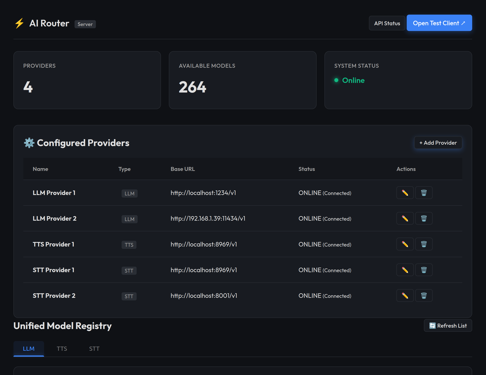
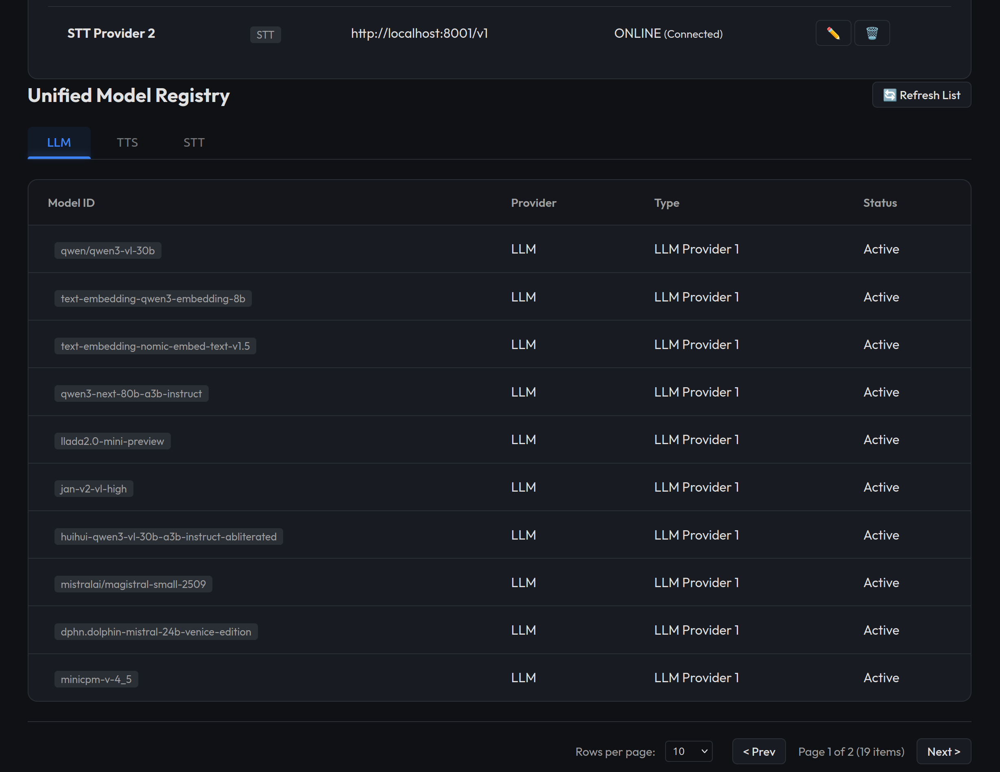
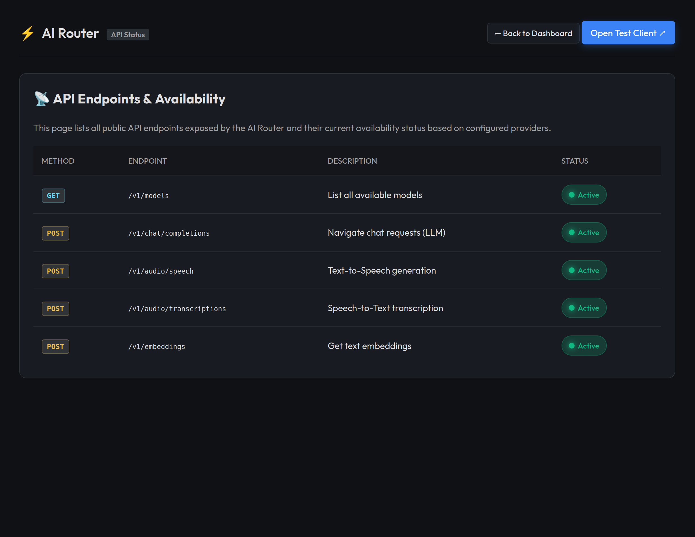
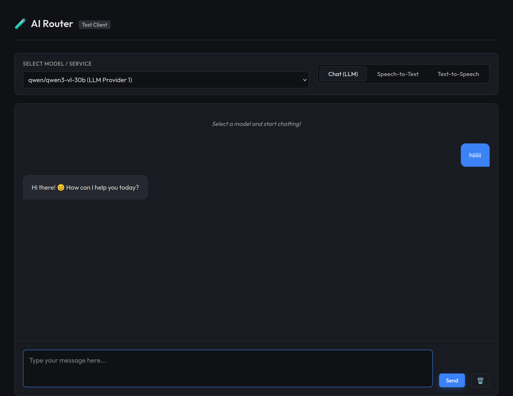
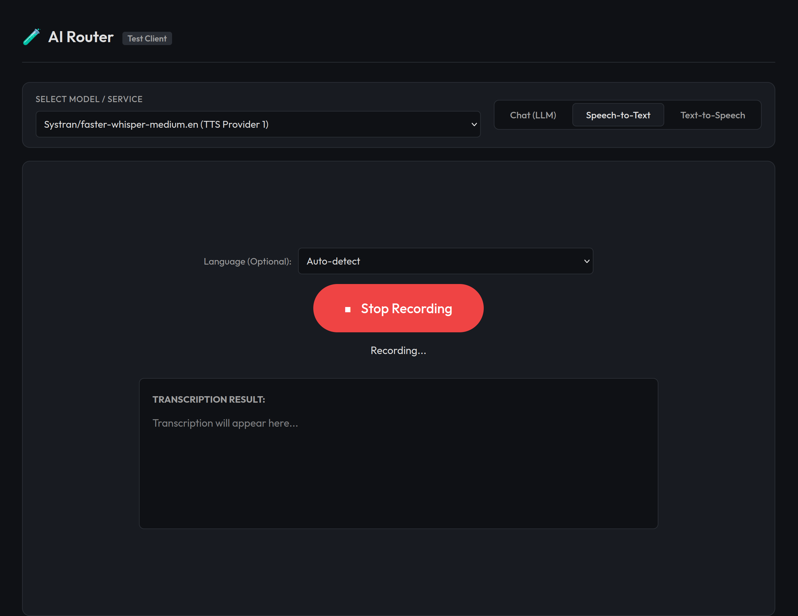
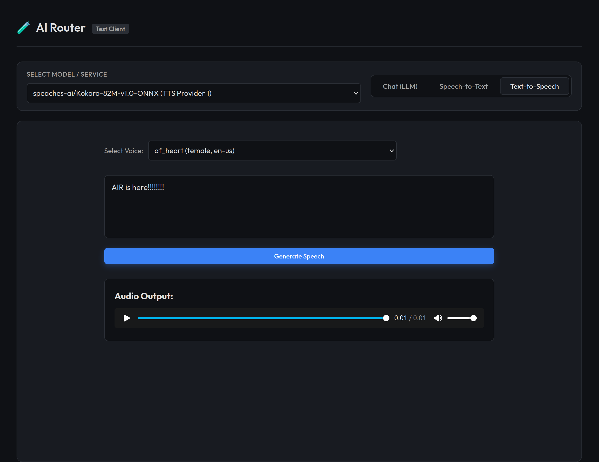

# AI Router (AIR) ⚡

**Unified Logical Reasoning & Audio Workbench**

AI Router (AIR) is a powerful proxy and routing system designed to unify various AI services (LLMs, STT, TTS) under a single, standardized OpenAI-compatible API. It simplifies the integration of multi-modal AI capabilities into applications by managing providers, routing requests, and providing a unified dashboard.

## 🚀 Features

*   **Unified API**: Standardized endpoints for Chat (`/v1/chat/completions`), Speech-to-Text (`/v1/audio/transcriptions`), and Text-to-Speech (`/v1/audio/speech`).
*   **Multi-Provider Support**: Seamlessly integrate with any OpenAI-compatible provider (e.g., local endpoints like Ollama, LocalAI, vLLM, or cloud providers).
*   **Smart Routing**:
    *   **Dynamic Model Discovery**: Automatically fetches and aggregates models from all configured providers.
    *   **Intelligent Type Inference**: Detects if a model is for Chat, STT, or TTS based on metadata.
    *   **Load Balancing & Fallback**: (Architecture ready) Designed to handle multiple providers for reliability.
*   **Interactive Dashboard**:
    *   **Provider Management**: Add, edit, and monitor AI providers on the fly.
    *   **Model Registry**: Browse all available models across all providers in one unified list.
    *   **API Status**: Real-time health check of exposed API endpoints.
*   **Test Client Workbench**: A built-in, feature-rich testing interface.
    *   **Chat**: Full Markdown support, streaming-ready, and conversation history.
    *   **STT**: Recording interface with language selection.
    *   **TTS**: Text-to-speech generation with dynamic voice selection.

## 🛠️ Architecture

The project is built on a highly modular API Gateway architecture using **FastAPI**, emphasizing Separation of Concerns.

1.  **AIR Server (`server/`)**:
    *   Acts as the central reverse-proxy router for AI requests.
    *   **API Layer (`server/api/`)**: Defines OpenAI-compatible `/v1` routes (chat, audio, models) and admin configuration endpoints.
    *   **Core Infrastructure (`server/core/`)**: Handles dynamic dependency injection, secure `.env` management, and the `httpx` streaming proxy engine.
    *   **Service Layer (`server/services/`)**: The `ProviderManager` acts as the brain, caching available models and dynamically pairing incoming payloads with the correct upstream host (e.g., matching Kokoro requests to a Speaches-AI target).
    *   Serves the Admin Dashboard (`http://localhost:5512`).

2.  **AIR Client (`client/`)**:
    *   A separate testing workbench service running at `http://localhost:5511`.

## 📦 Installation & Setup

### Prerequisites
*   Python 3.11+
*   [Conda](https://docs.conda.io/en/latest/) (Miniconda or Anaconda)
*   `pip` (Python Package Manager)

### 1. Clone & Set Up Environment
```bash
git clone <this-repo-url>
cd AI-Router-AIR

# Create and activate a conda environment
conda create -n air python=3.11 -y
conda activate air

# Install the project with all dependencies
pip install -e .

# (Optional) Install dev dependencies for running tests
pip install -e ".[dev]"
```

### 2. Configuration
Create a `.env` file in the root directory (or use `.env.example` as a template):
```ini
# Server Configuration
SERVER_PORT=5512
CLIENT_PORT=5511
LOG_LEVEL=INFO

# Default Providers (Optional - can be added via UI)
# PROVIDERS_JSON=[{"name": "LocalAI", "base_url": "http://localhost:8080/v1", "api_key": "na", "type": "llm"}]
```

### 3. Run the Application
Use the provided runner script to start both Server and Client:
```bash
python run.py
```

## 🖥️ Usage

### 1. Server Dashboard (Admin)
Manage your AI infrastructure at [http://localhost:5512](http://localhost:5512).

*   **Configuration**: Add and manage providers.
    

*   **Model Registry**: Unified view of all discovered models.
    

*   **API Status**: Real-time health monitoring.
    

### 2. Client Workbench (Testing)
Test your integrations at [http://localhost:5511](http://localhost:5511).

*   **Chat Interface**: Context-aware LLM testing with history.
    

*   **Speech-to-Text**: Voice recording and transcription.
    

*   **Text-to-Speech**: Audio generation with voice selection.
    

## 📂 Project Structure

```text
server/
├── main.py                 # Application entry point & global middleware
├── api/                    # API Layer: Request handling & Routing
│   ├── router.py           # Top-level router (includes /v1, admin, health)
│   ├── admin.py            # Configuration endpoints for providers
│   ├── health.py           # Health checks for server and APIs
│   └── v1/                 # Version 1 API grouping (OpenAI Compatible)
│       ├── router.py       # Includes all sub-routers (chat, audio, etc.)
│       ├── chat.py         # Routes for /v1/chat/*
│       ├── audio.py        # Routes for /v1/audio/*
│       ├── models.py       # Routes for /v1/models
│       └── ...             # (One file per major category)
├── core/                   # Core Logic & Infrastructure
│   ├── config.py           # Pydantic-based configuration (Settings)
│   ├── env_manager.py      # Logic for .env file read/write
│   ├── logging.py          # Centralized logging configuration
│   ├── proxy_engine.py      # Centralized logic for httpx proxying
│   ├── dependencies.py     # FastAPI dependencies (Auth, Providers)
│   ├── exceptions.py       # Custom exception handlers
│   └── ...
├── services/               # Service Layer: Business Logic
│   ├── provider_manager.py # Handles backend AI provider state & model cache
│   ├── discovery.py        # Logic for scanning and detecting providers
│   └── ...
├── schemas/                # Data Models (Pydantic models)
│   ├── provider_schema.py   # Internal provider definitions
│   └── ...
├── static/                 # Frontend assets (JS, CSS, Images)
└── templates/              # Jinja2 HTML templates for Dashboard
pyproject.toml              # Unified dependency management
run.py                      # Multi-service runner script
```

## 🔧 Pre-commit Hooks

This project uses [pre-commit](https://pre-commit.com/) to enforce code quality checks before each commit.

### Setup
```bash
pip install pre-commit
pre-commit install
```

### What's Included
| Hook | Purpose |
|---|---|
| `trailing-whitespace` | Removes trailing whitespace |
| `check-merge-conflict` | Prevents committing unresolved merge conflicts |
| `end-of-file-fixer` | Ensures files end with a newline |
| `ruff` | Python linting with auto-fix |
| `codespell` | Catches common spelling mistakes |
| `interrogate` | Enforces ≥80% docstring coverage |

### Usage
Hooks run automatically on `git commit`. To run manually on all files:
```bash
pre-commit run --all-files
```

## 🤝 Contributing
Contributions are welcome! Please feel free to submit a Pull Request.

## 📄 License
GPL-3.0
