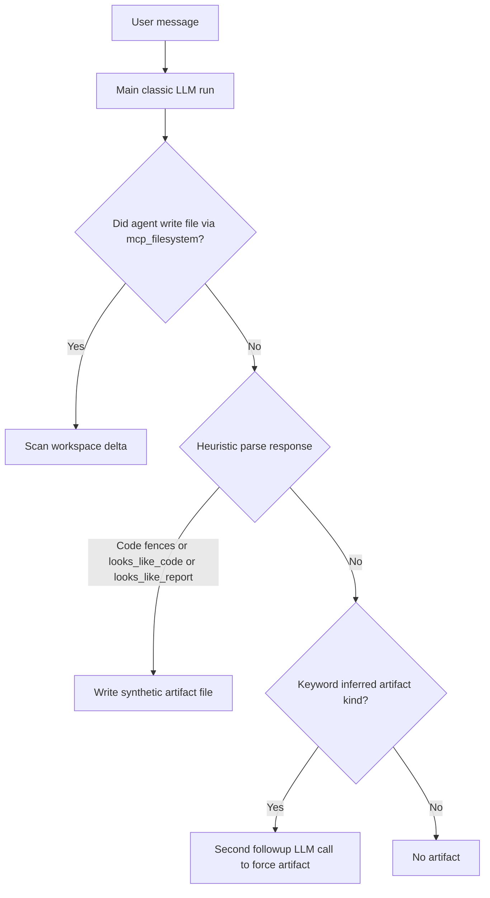
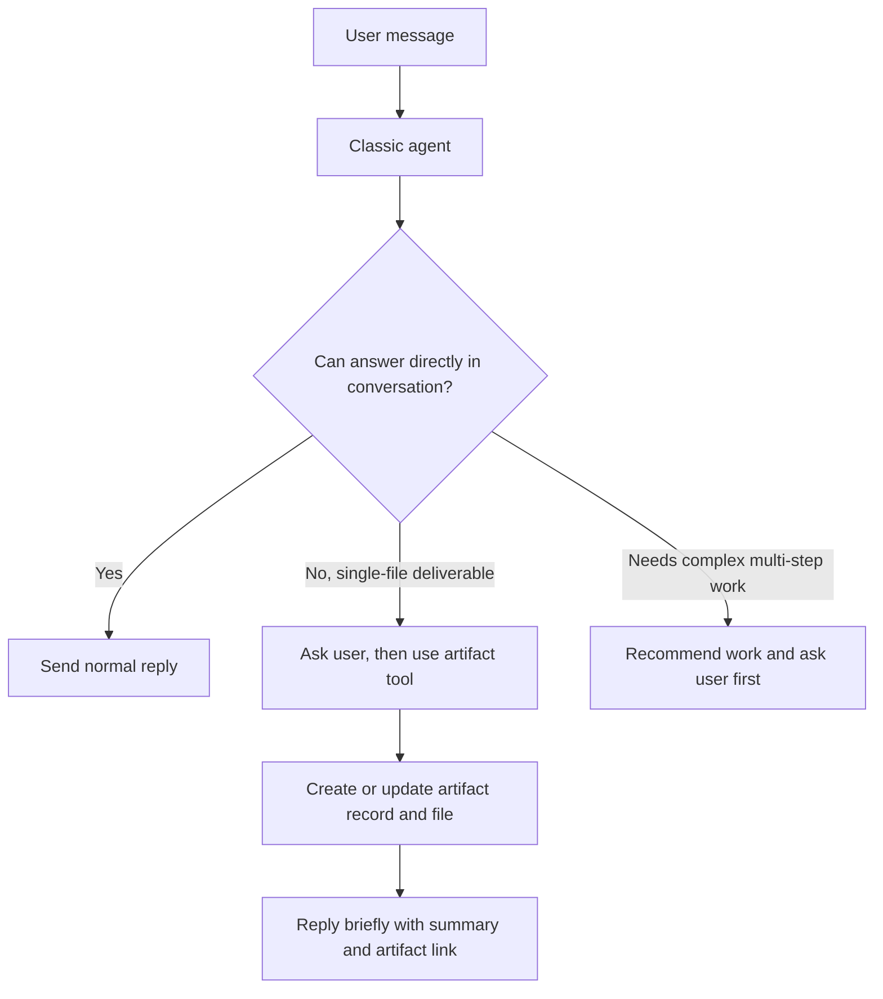
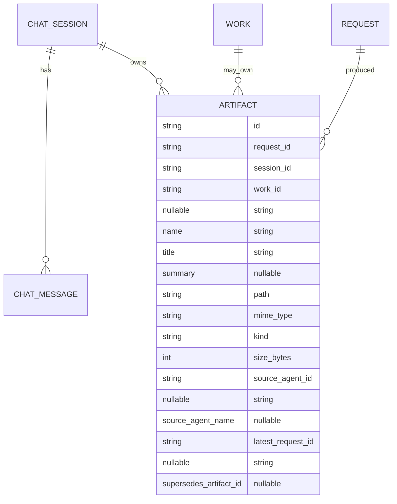

# Classic Chat Artifact Redesign Plan

## Problem Statement

The current artifact handling in classic chat is not first-class. Artifact creation is largely reconstructed after the main LLM run using backend heuristics instead of being intentionally managed by the classic chat agent itself.

Current problems:

1. Artifact creation is owned by `chanakya/chat_service.py`, not by the agent.
2. Artifact existence depends on regexes, workspace scanning, response parsing, and post-run heuristics.
3. Artifact generation may trigger a second LLM call to force an artifact after the main answer already completed.
4. Artifacts are not managed like first-class conversational objects the way work items are.
5. The classic agent is already nudged to save deliverables via `mcp_filesystem`, but backend artifact registration still happens indirectly.
6. Classic chat should be a conversational agent first, not a silent background artifact synthesizer.
7. Work creation should remain rare in classic chat, especially for a voice assistant.

## Product Intent

### Classic Chat

Classic chat should remain a conversation-first agent.

It should:

1. Reply directly in chat by default.
2. Create or update an artifact when the deliverable is a simple single file better saved than spoken or conversationally rendered.
3. Ask the user first before creating an artifact when artifact creation is optional or may take noticeable time.
4. Only create or route to work when the user explicitly asks, or when Chanakya asks and the user approves.

### Artifacts

Artifacts are for simple saved deliverables such as:

1. Code files
2. Text notes
3. Markdown documents
4. SVG files
5. Other single-file outputs

Artifacts are not mini-workflows. They are durable single-file resources that the main classic chat agent can manage directly.

### Work

Work remains the right abstraction for complex execution such as:

1. Long research
2. Multi-file operations
3. Multi-step execution
4. Extended delegated workflows
5. Long-running background tasks

## Current Architecture Problem

This is the main behavior to remove.

## Target Architecture

Artifacts should be first-class, tool-driven resources just like work is first-class and tool-driven.

## Core Design Decisions

1. Add a first-class MCP artifact tool server.
2. Let the main classic agent create and update artifacts explicitly through tools.
3. Keep `mcp_filesystem` available for now, but instruct the classic agent to prefer `mcp_artifact_tools` for user-facing deliverables.
4. Remove heuristic artifact creation and followup artifact-generation calls from `ChatService`.
5. Source response artifacts from explicit persisted artifact records instead of inferred text parsing.
6. Make classic chat direct-first, artifact-second, and work-rare.
7. Chanakya should ask before creating an artifact when the user did not explicitly ask for a saved file.

## Artifact and Work Relationship

Artifacts and work are related, but distinct.

1. Every artifact belongs to a request.
2. Every artifact belongs to a chat session.
3. An artifact may optionally belong to a work item.
4. Classic direct artifacts use `work_id = null`.
5. Work-scoped artifacts use `work_id = work_xxx`.

## Database Direction

Use Option B.

Because the database file has already been removed, no migration compatibility work is needed. We can evolve `ArtifactModel` directly.

Recommended metadata additions:

1. `title`
2. `summary`
3. `latest_request_id`
4. `supersedes_artifact_id`

These support better artifact management and follow-up editing behavior.

## Proposed Tooling

Add a new MCP server similar to `chanakya/services/mcp_work_tools_server.py`.

Suggested initial tools:

1. `create_artifact`
2. `update_artifact`
3. `list_artifacts`
4. `get_artifact`
5. `read_artifact_text`

Possible future tools:

1. `rename_artifact`
2. `append_artifact_content`
3. `delete_artifact`

## Runtime Behavior Rules

### Direct Reply

If the answer can be naturally delivered in conversation, Chanakya should just reply.

### Artifact Creation

If the answer is better delivered as a single saved file, Chanakya should:

1. Ask the user first when the artifact was not explicitly requested.
2. Create the artifact with the artifact tool once the user agrees.
3. Return a short conversational summary and the artifact link.

### Work Creation

If the request requires long research, multi-file work, or complex execution, Chanakya should recommend work and ask first. Work creation must stay rare in classic chat.

## Implementation Plan

### Phase 1. Add first-class artifact persistence support

1. Extend `ArtifactModel` with richer first-class metadata.
2. Extend the repository with create, update, list, and lookup helpers suitable for tool-driven management.
3. Keep artifact API serialization aligned with the richer payload.

### Phase 2. Add MCP artifact tools

1. Create `chanakya/services/mcp_artifact_tools_server.py`.
2. Implement artifact create and update paths as atomic file-plus-record operations.
3. Return artifact payloads that the classic agent and frontend can reuse directly.

### Phase 3. Give Chanakya the artifact tool

1. Add `mcp_artifact_tools` to Chanakya's tool list.
2. Keep `mcp_filesystem` for now.
3. Update prompt instructions so user-facing saved deliverables go through artifact tools.

### Phase 4. Refactor classic chat flow

1. Remove workspace-delta artifact detection.
2. Remove response-text artifact materialization.
3. Remove followup LLM calls that exist only to force artifacts.
4. Attach artifacts to replies from explicit artifact records created during the request.

### Phase 5. Refine classic policy

1. Default to direct conversational response.
2. Ask before artifact creation when the user did not explicitly ask for saving.
3. Never auto-create work from classic chat.
4. Recommend work only when clearly needed and only after asking.

### Phase 6. Frontend and API polish

1. Preserve current artifact links.
2. Surface richer artifact metadata where useful.
3. Support clearer new-vs-updated artifact messaging if needed.

### Phase 7. Tests

1. Direct classic reply with no artifact.
2. Explicit code/file request creates artifact through tool.
3. Artifact update flow works.
4. No heuristic artifact generation remains.
5. No second artifact-only LLM followup call remains.
6. Classic chat does not auto-create work.
7. Work-scoped artifacts retain `work_id`.

## Acceptance Criteria

The redesign is successful when:

1. Artifact creation in classic chat happens through explicit tools, not backend heuristics.
2. Chanakya remains direct-first in classic chat.
3. Chanakya asks before creating an artifact unless the user explicitly requested a file or save action.
4. Work creation remains rare and never automatic from classic chat.
5. Artifact records are rich enough to support future referential updates cleanly.
6. Reply artifacts are sourced from persisted artifact records created during execution.
